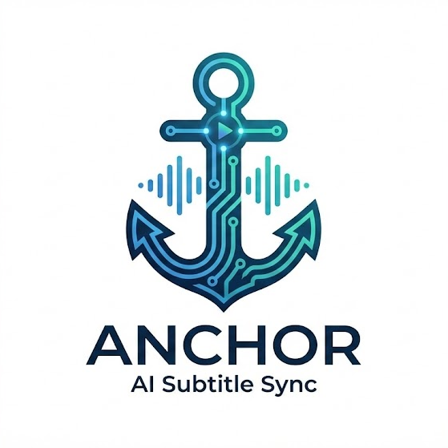
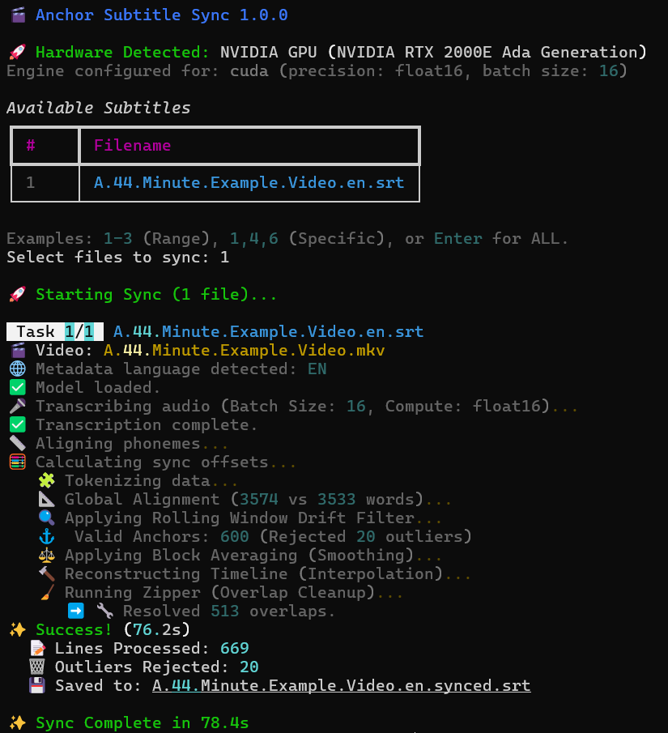

<p align="left">
	
</p>

# ⚓ Anchor Subtitle Sync

**Anchor** is a GPU-accelerated tool that automatically synchronizes subtitle files (.srt, .ass) to video files using audio alignment. It uses OpenAI's Whisper (via WhisperX) to listen to the video track and perfectly align every subtitle line.

## How It Works — Under the Hood

A short summary: Anchor uses WhisperX plus a multi-stage elastic alignment pipeline (phoneme alignment, global fuzzy alignment, rolling-window drift correction, and timeline interpolation) to produce millisecond-accurate subtitle sync.

- **Transcription:** WhisperX for high-quality transcripts + forced alignment.
- **Phoneme Alignment:** Maps audio to phonemes for word-level timing.
- **Global Alignment:** Fuzzy matching to find anchors between script and audio.
- **Drift Correction:** Rolling-window filter to correct long-term drift.
- **Cleanup:** Interpolation + overlap-fixer ("Zipper") for clean subtitles.

<details>
<summary>Full explanation (expand)</summary>

Many syncing tools rely on simple waveform matching or standard speech-to-text, which often results in "drift" (where subtitles slowly get out of sync) or fails when the actor changes a line.

The engine combines WhisperX with a multi-stage Elastic Alignment Algorithm. Here is what is happening during those processing steps and why it matters.

1. Why WhisperX instead of Faster-Whisper?
Standard faster-whisper is incredible at transcription, but it often "hallucinates" timestamps. It guesses roughly when a sentence started, often missing by 0.5 to 1.0 seconds.

WhisperX adds a crucial post-processing step called Forced Alignment.

The Difference: Instead of just listening for words, it maps the audio to specific Phonemes (the distinct units of sound, like the "t" in "cat").

The Result: The tool doesn't just know what was said; it identifies word-level timing precision down to the millisecond. This provides the bedrock for perfect sync.

2. The Alignment Logic (Step-by-Step)
Once transcription is complete, the custom syncing pipeline merges the provided script with the actual audio.

📏 Aligning Phonemes: The system maps the raw audio sounds to the text characters. This ensures that even if the actor speaks quickly or mumbles, the tool catches the exact moment the sound occurs.

📐 Global Alignment (e.g., 6153 vs 6063 words): Scripts rarely match the final audio perfectly. Actors add-lib, scenes get cut, or words are repeated.

Standard tools fail here because they look for a 1:1 match.

This tool performs a "fuzzy match" global alignment, mathematically calculating the best fit between the two datasets even when the word counts differ.

🔍 Rolling Window Drift Filter: Over a long video, audio timing can "drift" (often due to frame rate conversions like 23.976fps vs 24fps). This step analyzes the timeline in moving segments to detect and correct gradual desynchronization before it becomes noticeable to the viewer.

⚓️ Valid Anchors (e.g., 618 Anchors): The system identifies "Anchors"—points of absolute certainty where the audio and text match perfectly with high confidence.

Rejection: It automatically discards "Outliers" (matches that seem statistically unlikely or erroneous), ensuring the timeline is pinned down only by high-quality data.

🔨 Reconstructing Timeline (Interpolation): Using the Anchors as fixed distinct points, the system mathematically "stretches" or "compresses" the text between them. This ensures that the dialogue between the perfect matches flows naturally and stays in sync.

🧹 Running The Zipper (Overlap Cleanup): Subtitle overlaps are messy and hard to read. "The Zipper" is a final polish pass that detects when two subtitle events collide. It dynamically adjusts the start/end times to ensure one line finishes exactly as the next one begins, resolving conflicts automatically.

Why use this over other tools?
Most tools treat subtitles as a static block of text. This system treats them as a dynamic, elastic timeline. By using Phoneme-level anchoring combined with Drift Correction, the tool can sync messy, imperfect scripts to audio with a precision that manual matching simply cannot achieve.

</details>

## 🌍 Automatic Cross-Language Sync

Anchor 1.1+ can now synchronize subtitles even when they are in a different language than the audio (for example, English audio with Portuguese subtitles). This is done by creating a temporary "ghost" translation of your subtitles into the audio language, syncing that translation to the audio, and then applying the improved timestamps back to your original file.

<details>
<summary>How it works (expand)</summary>

1. **Detection:** Anchor detects a mismatch between the audio language and the subtitle file language (e.g., Audio: EN, Subtitle: PT).

2. **Translation:** Anchor uses a fast neural translation model (NLLB via CTranslate2) to create a temporary translated subtitle file in the audio language.

3. **Sync:** The temporary "ghost" translation is synchronized against the audio track using the normal alignment pipeline.

4. **Restoration:** The accurate timestamps are transferred back to your original subtitle file, preserving the original text while fixing timing.

The result is your original subtitle text, timed accurately to the foreign-language audio.

</details>

### 🧠 Translation Models

Anchor uses NLLB-200 (No Language Left Behind) via the `ctranslate2` engine for high speed and low memory usage. You can override the automatic choice with the `-t` / `--translation-model` flag.

Note: The first time you use a translation model it will be downloaded automatically (approx. 1GB — 3.5GB depending on model). Models are cached locally for reuse.

Supported Translation Models
----------------------------

The following pre-built CTranslate2 models are supported and can be passed directly to `-t`:

- `softcatala/nllb-200-distilled-600M-ct2-int8`
- `OpenNMT/nllb-200-distilled-600M-ct2-int8`
- `softcatala/nllb-200-1.3B-ct2-int8`
- `OpenNMT/nllb-200-distilled-1.3B-ct2-int8`
- `OpenNMT/nllb-200-1.3B-ct2-int8`
- `OpenNMT/nllb-200-3.3B-ct2-int8`

For convenience, Anchor also supports shorthand names that map to reasonable defaults:

| Shorthand | Model |
| --------- | ----- |
| `small` | `softcatala/nllb-200-distilled-600M-ct2-int8` |
| `medium` | `softcatala/nllb-200-1.3B-ct2-int8` |
| `large` | `OpenNMT/nllb-200-3.3B-ct2-int8` |

Example usages:

```bash
anchor -t small
anchor --translation-model OpenNMT/nllb-200-1.3B-ct2-int8
```

And ensure you have enough disk space for model downloads.

## ⚡ Performance Test with model large-v3

- GPU (NVIDIA RTX 2000E): synced a 44-minute episode in ~82 seconds.
- CPU (Intel i5-12600H): synced the same 44-minute episode in ~16 minutes.
- Notes: Results vary by hardware, drivers, and model precision. Haven't tested other devices extensively; it should work on AMD and Intel GPUs as well.

### ⚡ Performance Benchmarks

*Tests performed on a 44-minute video file (English). With music and gun fire scenes.* **Hardware:** NVIDIA RTX 2000E Ada Generation (16 GB)

| Model | Translation | Time | Speed | Anchors Found | User Score | Notes |
| :--- | :---: | :---: | :---: | :---: | :--- | :--- |
| **Large-v3** | 3.3B | 98s | ~27x | 514 | 10 / 10 | Translation of 669 lines added 16s. |
| **Large-v3** | N/A | 82s | ~32x | 600 | 10 / 10 | The gold standard for accuracy, but slower. |
| **Medium.en** | N/A | 62s | ~42x | 598 | 10 / 10 | Best Balance. Perfect sync, identical to Large-v3 but 25% faster. |
| **Small.en** | N/A | 44s | ~60x | 603 | 9.9 / 10 | Fastest usable. Twice as fast as Large-v3. Minor sync drift (<0.1s). |
| **Base.en** | N/A | 35s | ~75x | 585 | 9.7 / 10 | Very fast, but prone to drift on non-speech sounds (e.g., gunshots). |

### 📉 CPU Performance Benchmarks

*Tests performed on a 44-minute video file (English).* **Hardware:** 12th Gen Intel Core i5-12600H

| Model | Translation | Time | Speed | Anchors Found | User Score | Notes |
| :--- | :---: | :---: | :---: | :---: | :---: | :--- |
| **Large-v3** | N/A | ~16 min | ~2.7x | 599 | 10 / 10 | *Baseline.* Too slow for daily use on CPU. |
| **Medium.en** |	1.3B | 12.5 min | ~3.5x | 518 | 10 / 10 | Translation of 669 lines added ~60s. |
| **Medium.en** | N/A | 11.5 min | ~3.8x | 595 | 10 / 10 | Accurate, but the extra 6-minute wait didn't add much value. |
| **Small.en** | N/A | 5.7 min | ~7.6x | 601 | 10 / 10 | 2x faster than Medium with *better* anchor detection. |
| **Base.en** | N/A | 4.1 min | ~11x | 579 | 9.7 / 10 | Decent, but not significantly better than Tiny to justify the extra time. |
| **Tiny.en** | N/A | 3.7 min | ~12x | 572 | 9.5 / 10 | Incredibly fast. Good overall sync, but slightly less precise start times (ms delay). |

## 🚀 Requirements

* **OS:** Linux | Windows | MacOS
* **GPU:** GPU Recommended, CPU only is possible (but slower)
* **Python:** 3.10 or 3.11
* **ffmpeg / ffprobe:** required for audio probing, metadata language detection, and audio extraction

## 📦 Installation

### 1. Install Anchor
Install the tool directly from the repository.

```bash
pip install anchor-sub-sync
```
or

```bash
pip install git+https://github.com/ellite/anchor-sub-sync.git
```

**⚠️ Important:** Because this tool relies on hardware acceleration, standard `pip install` often pulls the wrong drivers (CPU versions). If it does not work out of the box, please follow these steps in order.

### 2. Install PyTorch (choose per hardware)

Before installing PyTorch, run a few quick checks to detect your hardware:

```bash
# NVIDIA / CUDA
nvidia-smi || true
python3 -c "import torch; print('cuda', torch.cuda.is_available(), getattr(torch.cuda, 'get_device_name', lambda i: '')(0))"

# Apple Silicon (MPS)
python3 -c "import torch; print('mps', torch.backends.mps.is_available())"
```

Then install the appropriate build:

- NVIDIA GPU with CUDA drivers installed:

```bash
pip install torch torchaudio torchvision --index-url https://download.pytorch.org/whl/cu121
```

- Apple Silicon (MPS) — follow PyTorch MPS instructions (example):

```bash
pip install torch torchaudio torchvision --index-url https://download.pytorch.org/whl/mps
```

- AMD / ROCm: follow the official PyTorch ROCm install instructions for your distribution (see https://pytorch.org).

- CPU-only systems:

```bash
pip install torch torchaudio torchvision
```

Notes:
- Only install the CUDA wheel if you have an NVIDIA GPU and matching drivers; installing a GPU wheel on a CPU-only system can produce subtle runtime errors.
- If you encounter the `torchvision::nms` error, force-reinstall matching PyTorch/TorchVision wheels (see Troubleshooting below).

### 3. Finalize Dependencies (Critical)
Some libraries may downgrade during installation. Run this command to ensure the GPU translation engine is up to date and compatible with your drivers:

```bash
pip install --upgrade ctranslate2
```

## 🛠️ Troubleshooting

### "Aborted" (Core Dump) on Launch
If the tool crashes instantly without an error message, it is a library path issue common on Linux. Run this command before starting `anchor`:

```bash
export LD_LIBRARY_PATH=$(python3 -c 'import os; import nvidia.cublas.lib; import nvidia.cudnn.lib; print(os.path.dirname(nvidia.cublas.lib.__file__) + ":" + os.path.dirname(nvidia.cudnn.lib.__file__))')
```
*(Tip: Add the line above to your `~/.bashrc` file to make it permanent.)*

### "Operator torchvision::nms does not exist"
This means you have a mismatch between PyTorch and TorchVision (usually one is CPU and one is GPU). Fix it by forcing a reinstall:

```bash
pip install --force-reinstall torch torchvision torchaudio --index-url [https://download.pytorch.org/whl/cu121](https://download.pytorch.org/whl/cu121)
```

### "Numpy is not compatible"
If you see errors related to `numpy` (e.g., `module 'numpy' has no attribute...`), downgrade it to a stable version:

```bash
pip install "numpy<2.0" "pandas<2.0"
```

## 🎬 Usage

Navigate to the folder containing your subtitles and video files, then run:

```bash
anchor
```

1.  **Select files:** Type `1` (specific file), `1-3` (range), or hit `Enter` to sync ALL subtitles in the folder.
2.  **Wait:** Anchor will transcribe the audio and align the subtitles.
3.  **Result:** A new `.synced.srt` file will be created next to the original.

Command line options
--------------------

You can override the automatic hardware detection or control specific settings using flags:

| Option | Alias | Description |
| ------ | ----- | ----------- |
| --model | -m | Force a specific Whisper model (e.g., tiny, medium, large-v3-turbo). |
| --batch-size | -b | Manually set the batch size (e.g., 8, 16). Useful for optimizing VRAM usage. |
| --translation-model | -t | Force a specific translation model (overrides automatic selection). |
| --help | -h  | Show the help message and exit. |

Examples
--------

Force a specific model:

```bash
anchor --model large-v3-turbo
```

Force batch size (to prevent crashes or increase speed):

```bash
anchor --batch-size 8
```

Combine flags:

```bash
anchor -m medium -b 16
```

## ⚙️ Development

To modify the code locally:

```bash
git clone [https://github.com/ellite/anchor-sub-sync.git](https://github.com/ellite/anchor-sub-sync.git)
cd anchor-sub-sync
pip install -e .
```
## 🖼️ Screenshots 

<p align="center">
  
</p>

---

## ❌ Uninstallation

If you installed Anchor via `pip` (GitHub), uninstall with:

```bash
pip uninstall anchor-sub-sync
```

If you used an editable install during development (`pip install -e .`), also remove the cloned repository directory and any virtual environment you created:

```bash
# from the project directory
deactivate  # if in a venv
rm -rf venv/  # or the name of your virtualenv
rm -rf anchor-sub-sync/  # delete the cloned repo if desired
```

To remove model caches or large downloaded files, delete the relevant cache directories (varies by model/backends), for example:

```bash
rm -rf ~/.cache/whisper ~/.cache/whisperx
```